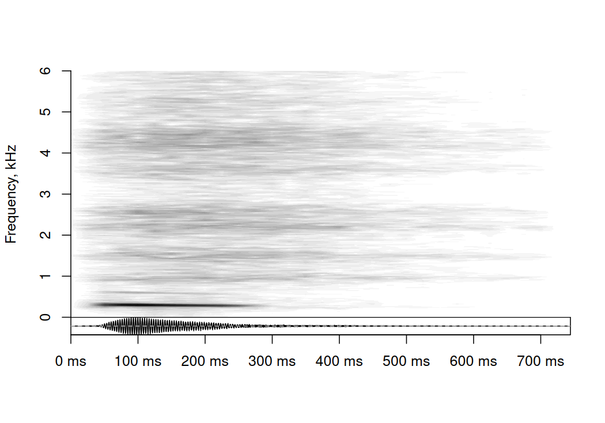

soundgen readme
================

<!-- README.md is generated from README.Rmd. Please edit that file -->

[](https://cran.r-project.org/package=soundgen)
[](https://CRAN.R-project.org/package=soundgen)

R package for sound synthesis and acoustic analysis.  
Homepage with help, demos, etc: <http://cogsci.se/soundgen.html>  

Performs parametric synthesis of sounds with harmonic and noise
components such as animal vocalizations or human voice. Also includes
tools for spectral analysis, pitch tracking, audio segmentation,
self-similarity matrices, morphing, etc.

# Key functions

-   Sound synthesis from R console: `soundgen()`
-   Shiny app for sound synthesis (opens in a browser): `soungen_app()`
-   Acoustic analysis of a wav/mp3 file: `analyze()`
-   Shiny app for editing intonation contours (opens in a browser):
    `pitch_app()`
-   Measuring syllables, pauses, and bursts in a wav/mp3 file:
    `segment()`

For more information, please see the vignettes on sound synthesis and
acoustic analysis:

`vignette("sound_generation", package="soundgen")`

`vignette("acoustic_analysis", package="soundgen")`

Or, to open the vignettes in a browser:  
`RShowDoc('sound_generation', package = 'soundgen')`

`RShowDoc('acoustic_analysis', package = 'soundgen')`

# Example of sound synthesis

Use the `soundgen()` function to create a breathy moan:

``` r
s = soundgen(
  sylLen = 230,               # duration of voiced part, ms
  pitch = c(305, 280),        # pitch, Hz (goes down from 305 to 380 Hz)
  ampl = c(0, -20),           # amplitude, dB (gradual fade-out by 20 dB)
  rolloff = -30,              # strong f0, weak harmonics
  temperature = 0.05,         # some stochasticity in generation
  formants = c(260, 960, 1500, 2200,  # F1-F8 formant frequencies, Hz
               2600, 3600, 4200, 4500),
  noise = data.frame(
    time = c(-50, 120, 700),  # time of noise anchors
    value = c(-15, -5, -50)   # noise amplitude, dB
  ),
  rolloffNoise = 0,           # flat noise spectrum before adding formants
  addSilence = 0, samplingRate = 44100, pitchSamplingRate = 44100,
  play = TRUE, plot = TRUE, osc = TRUE, ylim = c(0, 6)
)
```



<p>
<audio controls style = "display: block">
<source src="man/figures/s.mp3" type="audio/mp3">
</audio>
</p>

# Example of acoustic analysis

Use the `analyze()` function to detect pitch and obtain other spectral
descriptives of the sound we have just synthesized:

``` r
a = analyze(s, 44100, plot = TRUE, ylim = c(0, 6))
```


``` r
a$detailed[1:5, c('pitch', 'peakFreq', 'harmHeight', 'HNR', 'ampl', 'loudness')]
#>      pitch peakFreq harmHeight       HNR       ampl loudness
#> 1       NA       NA         NA        NA 0.02993491       NA
#> 2 291.4030 300.1361   582.8060  5.743706 0.19258955 11.19230
#> 3 293.9992 300.1361   881.9977 13.480664 0.41832141 18.21197
#> 4 293.8760 300.1361   881.9977 13.757051 0.53108777 22.46051
#> 5 292.1780 300.1361  1753.0680 12.266983 0.49117243 21.69834
colnames(a$detailed)
#>  [1] "duration"           "duration_noSilence" "time"               "amDep"             
#>  [5] "amDepVoiced"        "amFreq"             "amFreqVoiced"       "ampl"              
#>  [9] "amplVoiced"         "dom"                "domVoiced"          "entropy"           
#> [13] "entropyVoiced"      "epoch"              "f1_freq"            "f1_width"          
#> [17] "f2_freq"            "f2_width"           "f3_freq"            "f3_width"          
#> [21] "flux"               "harmEnergy"         "harmHeight"         "HNR"               
#> [25] "HNRVoiced"          "loudness"           "loudnessVoiced"     "novelty"           
#> [29] "noveltyVoiced"      "peakFreq"           "peakFreqVoiced"     "pitch"             
#> [33] "quartile25"         "quartile25Voiced"   "quartile50"         "quartile50Voiced"  
#> [37] "quartile75"         "quartile75Voiced"   "roughness"          "roughnessVoiced"   
#> [41] "specCentroid"       "specCentroidVoiced" "specSlope"          "specSlopeVoiced"   
#> [45] "subDep"             "subRatio"           "voiced"
```

# Installation

To install the current release from CRAN: `install.packages("soundgen")`

NB: Make sure all dependencies have been installed correctly! For
problems with seewave, see <https://rug.mnhn.fr/seewave/>

On Macs, you may need to do the following:

-   First install brew according to the instructions here:
    <https://brew.sh/>
-   Then run the following from the terminal  
    `brew install libsndfile`  
    `brew install fftw`
-   Finally, install soundgen in R:  
    `install.packages("soundgen")`
